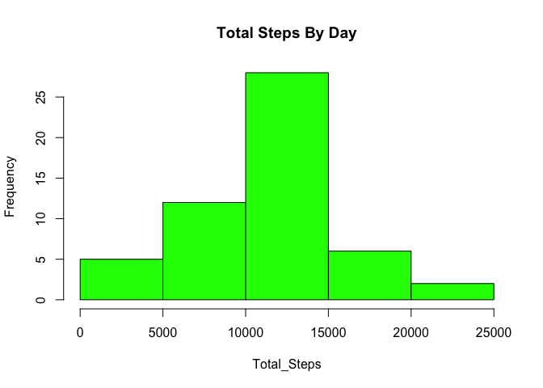
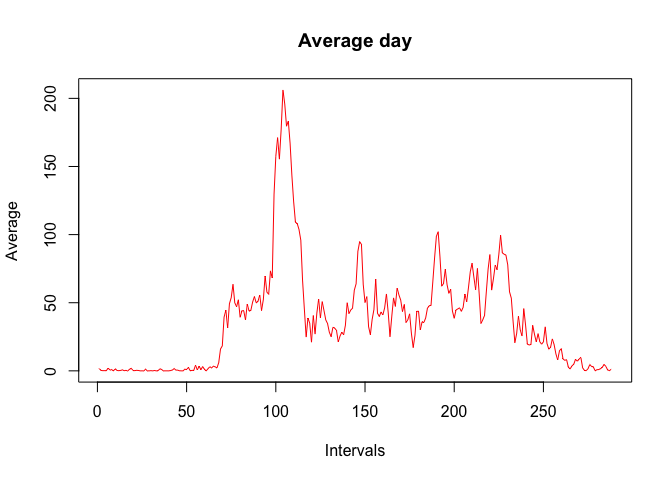
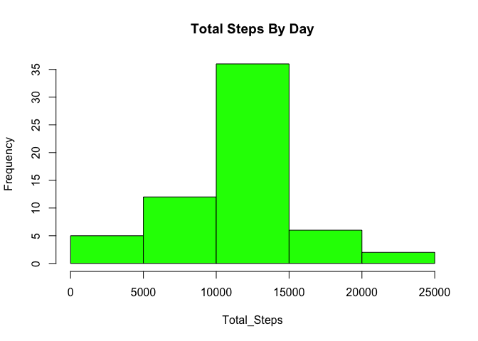
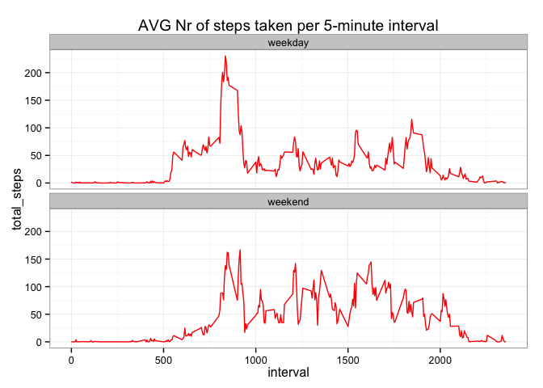

# Reproducible Research: Peer Assessment 1


## Loading and preprocessing the data
Global settings
Set english language default

```r
Sys.setlocale("LC_ALL","C")
```

```
## [1] "C/C/C/C/C/it_IT.UTF-8"
```

Install necessary library

```r
library('sqldf')
library('ggplot2')
```

1.Load the data

```r
#Create data.frame from activity csv
activity<-read.csv("activity.csv")
```


## What is mean total number of steps taken per day?
1.Calculate the total number of steps taken per day


```r
activity$date<-as.Date(activity$date, "%Y-%m-%d")
TotalStepsByDay<-sqldf('select sum(steps) as total_steps,
                        date
                        from
                        activity
                        where steps <> "NA"
                        group by date
                        order by date')
```


2.If you do not understand the difference between a histogram and a barplot, research the difference between them. Make a histogram of the total number of steps taken each day


```r
hist(TotalStepsByDay$total_steps, main = "Total Steps By Day", 
     ylab = "Frequency", xlab = "Total_Steps", col = "green")
```

 

3.Calculate and report the mean and median of the total number of steps taken per day
Mean:

```r
MeanTotalStepsByDay<-mean(TotalStepsByDay$total_steps)
print(MeanTotalStepsByDay)
```

```
## [1] 10766.19
```
Median:

```r
MedianTotalStepsByDay<-median(TotalStepsByDay$total_steps)
print(MedianTotalStepsByDay)
```

```
## [1] 10765
```


## What is the average daily activity pattern?
1.Make a time series plot (i.e. (type="l") of the 5-minutes interval (x-axis) and the average numbers of steps take,averaged across all days (y-axis))

```r
TimeSeriesIntervals<-tapply(activity$steps,activity$interval,mean,na.rm=TRUE)

plot(TimeSeriesIntervals, type = "l", xlab="Intervals", ylab="Average",
     main="Average day",col="red")
```

 

2.Which 5-minute interval, on average across all the days in the dataset, contains the maximum number of steps?

```r
MaxNumbersOfStepsInInterval<-which.max(TimeSeriesIntervals)
```
The 5 minute interval, on average across all the days in the dataset, which contains the maximum number of steps is:

```r
names(MaxNumbersOfStepsInInterval)
```

```
## [1] "835"
```


## Imputing missing values

1.Calculate and report the total number of missing values in the dataset (i.e. the total number of rows with NAs)

```r
TotalNAData<-sqldf('select *
                        from
                        activity
                        where steps = "NA" or steps is null ')

NrTotalNAData<-sqldf('select count(*) from TotalNAData')

print(NrTotalNAData[[1]])
```

```
## [1] 2304
```

2.Devise a strategy for filling in all of the missing values in the dataset. The strategy does not need to be sophisticated. For example, you could use the mean/median for that day, or the mean for that 5-minute interval, etc.

My stategy for filling in all of the missing value in the dataset is using the mean for that 5-minute interval.

3.Create a new dataset that is equal to the original dataset but with the missing data filled in.


```r
matrixTimeSeriesIntervals<-matrix(TimeSeriesIntervals)
namesTimeSeriesIntervals<-data.frame(names(TimeSeriesIntervals))
mergeMatrixNames<-data.frame(matrixTimeSeriesIntervals,namesTimeSeriesIntervals)
names(mergeMatrixNames)<-c("MeanByInterval","interval")

InputNA<-sqldf('select 
                (Case when A.steps is null then MeanByInterval else steps end) as steps, 
                A.date,
                A.interval
                from
                activity A
                left join
                mergeMatrixNames B on A.interval=B.interval
                ')
```


4.Make a histogram of the total number of steps taken each day and Calculate and report the mean and median total number of steps taken per day. Do these values differ from the estimates from the first part of the assignment? What is the impact of imputing missing data on the estimates of the total daily number of steps?


```r
TotalStepsByDayNAInput<-sqldf('select sum(steps) as total_steps,
                               date
                               from
                               InputNA
                               group by date
                               order by date')

hist(TotalStepsByDayNAInput$total_steps, main = "Total Steps By Day", 
     ylab = "Frequency", xlab = "Total_Steps", col = "green")
```

 

Mean 

```r
MeanTotalStepsByDayNAInput<-mean(TotalStepsByDayNAInput$total_steps)
print(MeanTotalStepsByDayNAInput)
```

```
## [1] 10749.77
```

Median

```r
MedianTotalStepsByDayNAInput<-median(TotalStepsByDayNAInput$total_steps)
print(MedianTotalStepsByDayNAInput)
```

```
## [1] 10641
```


## Are there differences in activity patterns between weekdays and weekends?

```r
InputNA$weekdayname<-weekdays(InputNA$date)
dfwithWeek<-sqldf('select 
                   steps,
                   date,
                   interval,
                   (Case when weekdayname in("Saturday","Sunday") then "weekend" 
                         else "weekday" end) as weekday_type
                   from InputNA
                 ')
```


```r
dfwithWeekAVG<-sqldf('select avg(steps) as total_steps, 
                    interval,
                    weekday_type
                    from dfwithWeek
                    group by interval, weekday_type
                    order by weekday_type,interval,total_steps
                 ')
```


```r
ggplot(dfwithWeekAVG, aes(x=interval, y= total_steps)) +
    facet_wrap(~weekday_type,nrow=2,ncol=1) +  
    geom_line(color="red") +
    labs("x=Interval,y=Total Steps") +
    theme_bw() +
    ggtitle("AVG Nr of steps taken per 5-minute interval")
```

 
